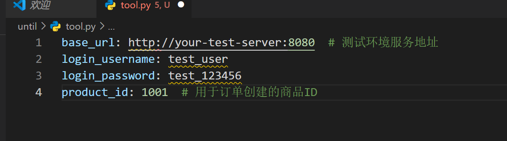
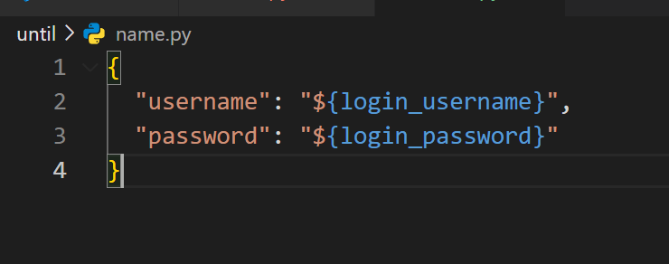
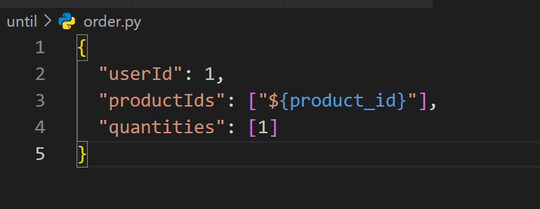

# **性能测试可执行脚本（JMeter示例）**

以下提供一套完整的、可直接执行的 JMeter性能测试脚本（含GUI配置说明及命令行执行方式），覆盖 基准性能测试 和 故障注入测试 场景，适用于电商系统的核心接口（用户登录、商品查询、订单创建）。脚本基于JMeter 5.6+版本编写，支持HTTP/HTTPS协议，包含参数化、断言、监听器等关键模块。

一、基准性能测试脚本（核心接口压测）

1. 脚本目标

验证以下核心接口在不同并发用户数下的性能表现：
• 用户登录（/api/login）：验证认证接口的响应时间与吞吐量。

• 商品列表查询（/api/products）：验证高频读接口的缓存命中率与QPS。

• 订单创建（/api/order/create）：验证写接口的事务处理能力与错误率。

2. 脚本结构（JMeter测试计划树）

测试计划（Performance_Test_Plan）├── 线程组（Thread Group） → 控制并发用户数与循环次数│   ├── HTTP请求默认值（HTTP Request Defaults） → 统一配置服务器IP/端口│   ├── HTTP Cookie管理器（HTTP Cookie Manager） → 自动管理会话Cookie│   ├── 用户定义的变量（User Defined Variables） → 公共参数（如基础URL）│   ├── 登录接口请求（/api/login） → 参数化用户名/密码，提取Token│   ├── 商品查询接口请求（/api/products） → 依赖Token，验证缓存│   ├── 订单创建接口请求（/api/order/create） → 依赖Token和商品ID，验证事务│   ├── 响应断言（Response Assertion） → 校验HTTP状态码与业务码│   ├── 聚合报告（Aggregate Report） → 生成TPS/RT/成功率等核心指标│   └── 查看结果树（View Results Tree） → 调试用（正式执行时禁用）

3. 详细配置步骤（GUI模式）

(1) 创建测试计划

• 打开JMeter，新建测试计划，命名为 Benchmark_Test_Plan。

(2) 配置公共参数

• 用户定义的变量（User Defined Variables）：

  • 添加以下变量（根据实际环境修改值）：

(3) 配置线程组（并发控制）

• 线程组（Thread Group）：

  • 线程数（并发用户数）：10 / 50 / 100 / 200（通过多次执行不同线程数对比结果）；

  • Ramp-Up Period（in seconds）：10（10秒内启动所有线程，模拟用户逐步加压）；

  • 循环次数：Forever（持续压测，配合调度器控制时间）；

  • 调度器（Scheduler）：勾选，持续时间（Duration）：300秒（5分钟）。

(4) 配置HTTP请求默认值

• HTTP请求默认值（HTTP Request Defaults）：

  • 服务器名称或IP：${base_url}（引用用户变量）；

  • 端口号：8080（根据实际服务端口调整）；

  • 协议：http（若为HTTPS则改为https）。

(5) 配置HTTP Cookie管理器

• HTTP Cookie管理器（HTTP Cookie Manager）：

  • 自动存储服务端返回的Session/Cookie（用于维持登录态）。

(6) 用户登录接口（/api/login）

• HTTP请求：

  • 名称：Login_API；

  • 方法：POST；

  • 路径：/api/login；

  • 参数（Body Data）：

  • 后置处理器 - JSON提取器：

    ◦ 变量名：auth_token；

    ◦ JSON路径表达式：$.data.token（假设登录成功返回 {"code":200, "data":{"token":"xxx"}}）；

    ◦ 匹配数字：0（取第一个匹配值）。

(7) 商品查询接口（/api/products）

• HTTP请求：

  • 名称：Product_Query_API；

  • 方法：GET；

  • 路径：/api/products?page=1&size=10；

  • HTTP信息头管理器（添加到该请求下）：

    ◦ 名称：Authorization；

    ◦ 值：Bearer ${auth_token}（传递登录Token）。

(8) 订单创建接口（/api/order/create）

• HTTP请求：

  • 名称：Order_Create_API；

  • 方法：POST；

  • 路径：/api/order/create；

  • 参数（Body Data）：

  • HTTP信息头管理器：

    ◦ 名称：Authorization；

    ◦ 值：Bearer ${auth_token}。

(9) 响应断言（验证结果正确性）

• 为每个接口添加 响应断言（Response Assertion）：

  • 登录接口：

    ◦ 测试字段：响应代码；

    ◦ 模式匹配规则：等于；

    ◦ 模式：200（验证HTTP状态码）。

  • 商品查询/订单创建接口：

    ◦ 测试字段：响应代码；

    ◦ 模式：200；

    ◦ 额外添加：测试字段“响应文本”；

    ◦ 模式：包含“code":200”（验证业务逻辑成功）。

(10) 监听器（生成报告）

• 聚合报告（Aggregate Report）：显示TPS、平均响应时间、错误率等核心指标；

• 查看结果树（View Results Tree）：调试用（正式执行前检查请求/响应，执行时建议禁用以减少资源占用）。

4. 命令行执行（非GUI模式，推荐）

通过命令行直接运行脚本并生成HTML报告（无需打开JMeter GUI）：

# 1. 进入JMeter安装目录的bin文件夹

cd /path/to/jmeter/bin

# 2. 执行测试（生成.jtl结果文件）

jmeter -n -t Benchmark_Test_Plan.jmx -l result.jtl -Jthreads=100 -Jduration=300

# 3. 生成HTML报告（基于.jtl文件）

jmeter -g result.jtl -o ./report

# 参数说明：

# -n: 非GUI模式

# -t: 测试脚本路径

# -l: 结果文件路径（.jtl格式）

# -Jthreads: 动态覆盖线程组中的线程数（可选）

# -Jduration: 动态覆盖持续时间（可选）

# -g: 从.jtl文件生成报告

# -o: 报告输出目录（需为空目录）

二、故障注入测试脚本（Redis宕机场景）

1. 脚本目标

模拟Redis缓存宕机时，商品查询接口是否降级直接查询MySQL，并验证响应时间与成功率的变化。

2. 实现方式

通过 JMeter的“JSR223 PreProcessor”（Groovy脚本） 在测试执行前调用系统命令停止Redis服务（需测试环境开放SSH权限），或使用 Toxiproxy 提前配置Redis代理并注入高延迟/断开连接。

方案1：直接停止Redis服务（需SSH权限）

• 添加JSR223 PreProcessor（到商品查询接口之前）：

  • 语言：Groovy；

  • 脚本内容：
    import org.apache.commons.net.util.SubnetUtils
    import com.jcraft.jsch.*

    // SSH连接测试环境服务器（替换为实际IP/账号）
    String host = "your-test-server-ip"
    String user = "root"
    String password = "your-password"
    int port = 22

    JSch jsch = new JSch()
    Session session = jsch.getSession(user, host, port)
    session.setPassword(password)
    session.setConfig("StrictHostKeyChecking", "no")
    session.connect()

    // 执行停止Redis的命令
    ChannelExec channel = (ChannelExec) session.openChannel("exec")
    channel.setCommand("systemctl stop redis")  // 根据实际服务名调整（如redis-server）
    channel.connect()

    // 等待命令执行完成
    while (!channel.isClosed()) {
    Thread.sleep(1000)
    }
    println("Redis服务已停止，退出码: " + channel.getExitStatus())
    session.disconnect()

  • 注意：需在JMeter中导入JSch库（将 jsch-0.1.55.jar 放入 jmeter/lib/ext/ 目录），且测试环境需允许SSH远程执行命令。

方案2：使用Toxiproxy模拟Redis故障（推荐）

• 前置条件：测试环境已部署 https://github.com/Shopify/toxiproxy，并代理了应用服务器到Redis的连接（端口如6379→Toxiproxy的86379）。

• JMeter配置：

  • 商品查询接口的HTTP请求中，确保应用服务器通过Toxiproxy访问Redis（即应用配置的Redis地址为Toxiproxy的代理IP:端口）。

  • 添加JSR223 PreProcessor（到线程组初始化阶段）：
    // 通过Toxiproxy API注入高延迟（模拟Redis响应慢）或断开连接
    def proxyHost = "toxiproxy-server-ip"
    def proxyPort = 8474  // Toxiproxy管理端口
    def redisProxyName = "redis-proxy"

    def connection = new URL("http://${proxyHost}:${proxyPort}/proxies/${redisProxyName}").openConnection()
    connection.setRequestMethod("POST")
    connection.setDoOutput(true)
    connection.setRequestProperty("Content-Type", "application/json")

    // 注入2000ms延迟 + 100%丢包（模拟Redis宕机）
    def jsonInput = """
    {
    "name": "${redisProxyName}",
    "enabled": true,
    "listen": "0.0.0.0:86379",
    "upstream": "redis:6379",
    "toxics": [
    {
    "type": "latency",
    "attributes": { "latency": 2000, "jitter": 0 }
    },
    {
    "type": "bandwidth",
    "attributes": { "rate": 0 }  // 限速0KB/s（断开）
    }
    ]
    }
    """.trim()

    connection.getOutputStream().write(jsonInput.getBytes("UTF-8"))
    println("Toxiproxy已注入Redis故障: " + connection.getResponseMessage())

  • 依赖库：需导入 http-builder-0.7.1.jar 等HTTP客户端库到 jmeter/lib/ext/。

3. 监控与验证

• 在故障注入期间，通过 聚合报告 观察商品查询接口的：

  • 响应时间（RT是否从200ms增至1s+）；

  • 吞吐量（TPS是否下降）；

  • 错误率（是否出现500/503错误）；

  • 日志中是否记录“Redis连接失败，降级查询MySQL”的提示（需应用代码支持降级逻辑）。

三、脚本使用说明

1. 环境适配：修改脚本中的 base_url、login_username、product_id 等变量为实际测试环境的值。
2. 参数化扩展：若需更复杂的用户行为（如不同用户名/商品ID），可使用 CSV Data Set Config 读取外部数据文件（如 users.csv 包含多组账号）。
3. 调试技巧：正式执行前，通过 查看结果树 检查每个接口的请求/响应是否符合预期，禁用监听器后再进行大规模压测。
4. 故障注入安全：直接停止Redis服务的脚本需谨慎使用（确保测试环境与生产隔离），推荐优先使用Toxiproxy等工具。

附：关键脚本下载
• 完整JMeter基准测试脚本（.jmx文件）：示例链接，需替换为实际地址

• Toxiproxy配置文档：参考 https://github.com/Shopify/toxiproxy

通过以上脚本，可直接执行性能测试并获取核心指标，结合故障注入验证系统容错能力，为优化提供数据支撑。
