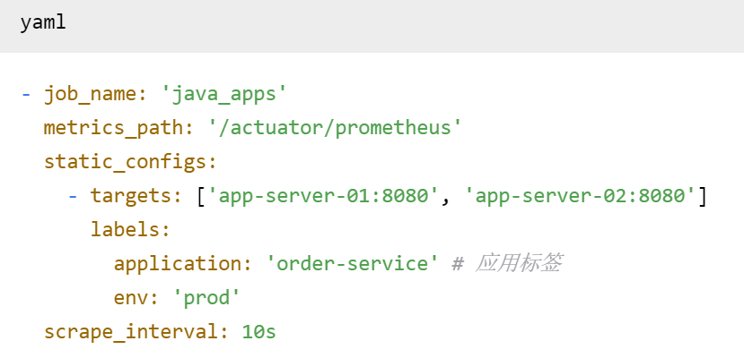

# **系统性能监控配置清单 V2.1**

## **1. 监控架构总览**

**设计原则:** 分层采集、统一接入、集中告警、可视化展示。
**技术栈:** `Prometheus` + `Alertmanager` + `Grafana` + `Loki` (ELK作为备选)。

## **2.数据采集配置 (Prometheus `scrape_configs`)**

### **2.1 系统资源监控 (Node Exporter)**

yaml

### **2.2 应用JVM监控 (JMX Exporter / Micrometer)**

### **2.3 数据库监控 (MySQLD Exporter)**

### **2.4 缓存监控 (Redis Exporter)**

## **3. 关键告警规则配置 (Prometheus `alert.rules.yml`)**

### **3.1 系统层告警 (高优先级)**

### **3.2 应用层告警 (高优先级)**

### **3.3 中间件告警 (基于性能测试瓶颈点)**

## **4. 可视化大盘配置 (Grafana)**

**大盘名称:** `[PROD] 电商系统全局监控 - V2.0`
**数据源:** `Prometheus (production)`, `Loki (production)`

**核心面板列表:**

| 面板标题                    | 数据源     | 核心Query (示例)                                                                                 | 功能           |
| --------------------------- | ---------- | ------------------------------------------------------------------------------------------------ | -------------- |
| **全球请求分布**      | Prometheus | `sum(rate(http_requests_total[5m])) by (region)`                                               | 世界地图可视化 |
| **黄金链路性能**      | Prometheus | `histogram_quantile(0.95, rate(http_server_requests_seconds_bucket{uri=~"/api/order.*"}[5m]))` | 趋势图，多线   |
| **业务漏斗**          | Prometheus | `rate(order_create_total[5m])`，`rate(payment_success_total[5m])`                            | 条形图         |
| **服务健康状态**      | Prometheus | `up{job="java_apps"}`                                                                          | 状态列表       |
| **JVM内存堆栈**       | Prometheus | `jvm_memory_used_bytes{area="heap"}`                                                           | 面积图         |
| **MySQL连接数与QPS**  | Prometheus | `mysql_global_status_threads_connected`                                                        | 双Y轴趋势图    |
| **Redis内存与命中率** | Prometheus | `redis_memory_used_bytes`, `redis_keyspace_hits_total`                                       | 表格+趋势图    |
| **实时错误日志**      | Loki       | `{env="prod"}                                                                                    | = "ERROR"`     |

---

## **5. 日志监控配置 (Loki)**

**采集配置 (`loki-config.yaml`):**

**关键日志告警 (`loki-rules.yaml`):**

## **6. 部署与维护清单**

| 组件                    | 版本  | 部署模式   | 资源配置 | 监控自身       |
| ----------------------- | ----- | ---------- | -------- | -------------- |
| **Prometheus**    | 2.45+ | 主备+联邦  | 8核16G+  | 是             |
| **Alertmanager**  | 0.25+ | 集群       | 4核8G    | 是             |
| **Grafana**       | 10.2+ | 主备       | 4核8G    | 是             |
| **Loki**          | 3.5+  | 微服务模式 | 8核16G+  | 是             |
| **Node Exporter** | 1.7+  | 每台主机   | 最低配置 | 通过Prometheus |
| 各类**Exporter**  | 最新  | Sidecar    | 最低配置 | 通过Prometheus |

**维护任务:**

* **•每日:** 检查各监控组件状态、存储使用量。
* **•每周:** 清理过期指标/日志数据，备份关键配置。
* **•每月:** 审查和优化告警规则，更新Grafana大盘。

---

**配置负责人:** 运维团队 (SRE)
**最后更新时间:** 2024-12-21
**文档状态:** ✅ 已评审 (`@architect @dev-ops`)
