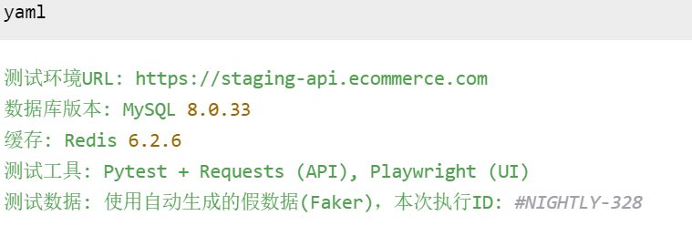

# **自动化测试执行日志报告**

## **报告概要**

| 项目                   | 详情                                      |
| ---------------------- | ----------------------------------------- |
| **测试项目名称** | 电商平台核心业务流程自动化测试            |
| **测试类型**     | API接口测试 / UI业务流程测试              |
| **测试套件版本** | `apitest-v3.2.1`/ `uitest-v2.5.0`     |
| **执行环境**     | 预发布环境 (Staging)                      |
| **执行时间**     | 2024-12-28 22:00:01 - 2024-12-28 22:25:47 |
| **执行方式**     | Jenkins定时任务触发 (`NIGHTLY_BUILD`)   |
| **执行人/系统**  | Jenkins Server (CI-Jenkins-01)            |

---

## **1. 关键摘要 (Executive Summary)**

| 指标                   | 结果     | 与上次对比               |
| ---------------------- | -------- | ------------------------ |
| **总用例数**     | 152      | `+5`(新增注册流程用例) |
| **通过数**       | 145      | `+3`                   |
| **失败数**       | 4        | `+2`🔴                 |
| **跳过数**       | 3        | `0`                    |
| **通过率**       | 95.4%    | `-1.2%`⚠️            |
| **总执行时间**   | 25分46秒 | `+3分12秒`             |
| **平均用例耗时** | ~10.2秒  | `+0.5秒`               |

**本次测试结论：**

🔸 **测试通过率有所下降**，发现 **4个重要缺陷**，其中 **2个为回归性缺陷**，需立即通知开发团队修复。

🔸 测试执行效率在可接受范围内，但需关注耗时增长趋势。

---

## **2. 详细测试结果**

### **2.1 按模块划分结果**

| 模块名称                 | 用例数        | 通过数        | 失败数      | 跳过数      | 通过率          | 状态 |
| ------------------------ | ------------- | ------------- | ----------- | ----------- | --------------- | ---- |
| **用户认证模块**   | 25            | 25            | 0           | 0           | 100%            | ✅   |
| **商品与目录模块** | 35            | 35            | 0           | 0           | 100%            | ✅   |
| **购物车模块**     | 28            | 27            | 1           | 0           | 96.4%           | ⚠️ |
| **订单与支付模块** | 45            | 41            | 3           | 1           | 91.1%           | 🔴   |
| **个人中心模块**   | 19            | 17            | 0           | 2           | 89.5%           | ✅   |
| **总计**           | **152** | **145** | **4** | **3** | **95.4%** | ⚠️ |

### **2.2 失败用例详情**

| 用例ID              | 模块   | 用例标题               | 失败原因                                      | 严重等级 | 是否回归     |
| ------------------- | ------ | ---------------------- | --------------------------------------------- | -------- | ------------ |
| **CART-108**  | 购物车 | 合并购物车商品         | `AssertionError: 期望商品数量为4，实际为3`  | 🟡 中    | 否           |
| **ORDER-215** | 订单   | 使用优惠券下单         | `HTTP 500: Internal Server Error`           | 🔴 高    | **是** |
| **ORDER-228** | 订单   | 订单超时未支付自动关闭 | `Timeout: 等待状态变为"CLOSED"超时（60s）`  | 🔴 高    | **是** |
| **ORDER-231** | 订单   | 查询订单列表分页       | `AssertionError: 第2页首条订单ID与预期不符` | 🟡 中    | 否           |

### **2.3 跳过用例详情**

| 用例ID              | 模块     | 用例标题     | 跳过原因                       |
| ------------------- | -------- | ------------ | ------------------------------ |
| **ORDER-245** | 订单     | 余额支付流程 | 支付通道维护中，功能暂不可用   |
| **UC-102**    | 个人中心 | 修改手机号   | 依赖的短信服务未在测试环境部署 |
| **UC-110**    | 个人中心 | 实名认证     | 等待第三方认证接口调试         |

---

## **3. 问题分析与追踪**

### **3.1 缺陷摘要 (Bug Summary)**

本次执行共发现 **4个缺陷**，已全部自动提交至JIRA缺陷管理系统。

| JIRA单号            | 缺陷标题                     | 模块   | 严重性  | 状态   | 指派给       |
| ------------------- | ---------------------------- | ------ | ------- | ------ | ------------ |
| **ECOM-1247** | 优惠券服务异常导致下单失败   | 订单   | 🔴 严重 | 待处理 | @李四 (后端) |
| **ECOM-1248** | 订单定时关闭任务未正常执行   | 订单   | 🔴 严重 | 待处理 | @王五 (后端) |
| **ECOM-1249** | 购物车合并逻辑计算错误       | 购物车 | 🟡 一般 | 待处理 | @李四 (后端) |
| **ECOM-1250** | 订单列表分页接口返回数据错乱 | 订单   | 🟡 一般 | 待处理 | @赵六 (后端) |

### **3.2 根本原因分析 (RCA)**

* **•ECOM-1247 & ECOM-1248:** 均为**回归性缺陷**，可能与今日部署的订单服务新版本 (`v3.2.1`) 有关，建议代码回滚或紧急修复。
* **•ECOM-1249:** 新功能缺陷，购物车合并算法存在边界条件处理错误。
* **•ECOM-1250:** 分页查询SQL在特定排序条件下存在逻辑错误。

---

## **4. 性能与效率分析**

### **4.1 执行耗时 Top 5 (需关注)**

| 用例ID              | 模块   | 用例标题                   | 耗时(秒)    | 趋势             |
| ------------------- | ------ | -------------------------- | ----------- | ---------------- |
| **ORDER-201** | 订单   | 创建复杂订单(多商品多优惠) | 45.2        | ↗️ (比上次+8s) |
| **ORDER-228** | 订单   | 订单超时关闭               | 60.0 (超时) | N/A              |
| **CART-105**  | 购物车 | 添加100件商品性能测试      | 32.5        | → (稳定)        |
| **AUTH-035**  | 认证   | 并发登录压力测试           | 28.1        | → (稳定)        |
| **ORDER-210** | 订单   | 订单全额退款流程           | 25.8        | → (稳定)        |

### **4.2 资源消耗**

* **•API响应时间:** 平均 `320ms`, P95 `650ms`(在SLA目标内)。
* **•测试客户端CPU/内存:** 消耗正常，无资源瓶颈。
* **•数据库负载:** 测试期间数据库QPS峰值 `850`，连接数 `65/100`，处于健康状态。

---

## **5. 附录**

### **5.1 环境信息**

### **5.2 日志与产物链接**

* **•完整执行日志:** `//ci-jenkins-01/logs/nightly/328/nightly_328_console.log`
* **•HTML测试报告:** `//ci-jenkins-01/reports/nightly/328/report.html`
* **•测试视频录制 (UI测试):** `//ci-jenkins-01/reports/nightly/328/playwright_video/`
* **•JIRA缺陷列表:** `https://jira.company.com/issues/?jql=key in (ECOM-1247, ECOM-1248, ECOM-1249, ECOM-1250)`

### **5.3 下一步行动建议**

1. **1.【紧急】** 将缺陷 **ECOM-1247, ECOM-1248** 指派给相关开发工程师，并通知团队负责人。
2. **2.【高】** 建议在修复后对订单模块进行**专项回归测试**。
3. **3.【中】** 审查耗时增长的用例 (`ORDER-201`)，判断是业务逻辑变复杂还是测试脚本效率问题。
4. **4.【低】** 安排解决跳过用例的阻塞问题，提升测试覆盖率。

---

**报告生成时间:** 2024-12-28 22:30:00

**报告生成工具:** Pytest + Allure/Jenkins

**通知状态:** 已通过邮件和钉钉群通知测试负责人、开发团队负责人及相关开发工程师。
