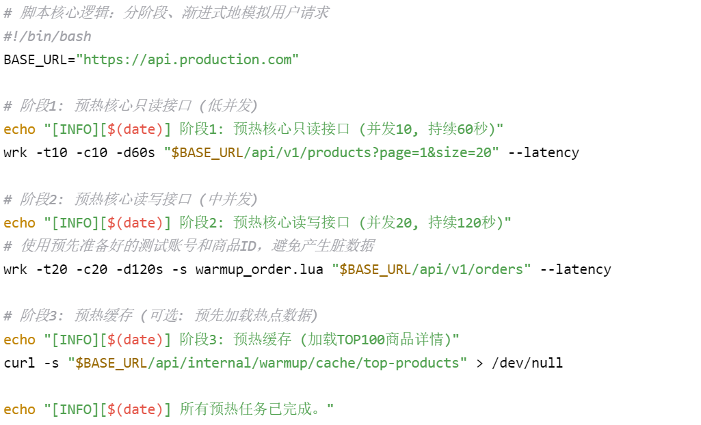
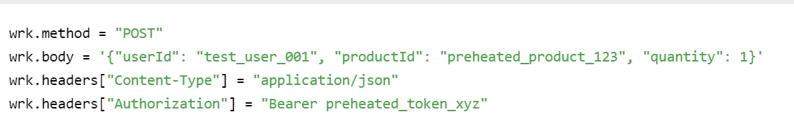

# **系统性能预热执行日志**

## **1. 预热概览**

| 项目                    | 详情                                                                              |
| ----------------------- | --------------------------------------------------------------------------------- |
| **系统/服务名称** | 电商交易系统 - 订单服务 (order-service)                                           |
| **预热执行时间**  | 2024-12-28 08:30:00 - 2024-12-28 09:00:00 (UTC+8)                                 |
| **预热执行环境**  | 生产环境 (Production)                                                             |
| **预热背景/目的** | 应对每日早高峰流量，避免JVM冷启动、缓存未命中、数据库连接池未就绪导致的响应延迟。 |
| **执行人员**      | SRE团队 - 张三                                                                    |
| **监控负责人**    | 运维团队 - 李四                                                                   |

---

## **2. 预热前系统状态 (Baseline)**

**记录时间：** 2024-12-28 08:25:00

| 指标                                  | 数值               | 状态      |
| ------------------------------------- | ------------------ | --------- |
| **系统平均负载 (Load Average)** | 0.8, 0.7, 0.6      | 🟢 正常   |
| **订单服务 - 堆内存使用**       | 1.2G / 4G          | 🟢 正常   |
| **订单服务 - JVM GC频率**       | Young GC: ~2次/min | 🟢 正常   |
| **Redis缓存命中率**             | 92%                | 🟢 正常   |
| **数据库连接池 (活跃/最大)**    | 25 / 200           | 🟢 正常   |
| **当前并发用户数 (估算)**       | ~500               | 🟢 低峰期 |

---

## **3. 预热策略与执行详情**

### **3.1 预热脚本执行记录**

**脚本名称：** `warm_up_production.sh`

**执行方式：** 由Jenkins任务定时触发 (`Schedule: 0 8 * * *`)

**Lua脚本 (`warmup_order.lua`) 内容:**

### **3.2 手动预热操作记录**

| 时间戳   | 操作内容                                      | 执行人         | 预期目标                           | 结果/备注                     |
| -------- | --------------------------------------------- | -------------- | ---------------------------------- | ----------------------------- |
| 08:30:05 | 登录预置的预热账号，生成有效Token             | @张三          | 预热认证模块，填充JWT缓存          | ✅ 成功，Token获取正常        |
| 08:32:10 | 手动执行 `curl`，查询核心热点商品详情页10次 | @张三          | 将热点商品数据加载到Redis和JVM缓存 | ✅ 成功，后续请求命中缓存     |
| 08:35:20 | 通过管理接口触发JVM代码预热 (`JIT编译`)     | @张三 (通过CI) | 避免首次请求的JIT编译开销          | ✅ 成功，触发主要代码路径编译 |

---

## **4. 预热期间关键监控指标变化**

**监控时间范围：** 08:25:00 - 09:00:00

**数据采集频率：** 10秒

| 时间               | 并发数 | 订单服务平均RT (ms) | 订单服务P95 RT (ms) | JVM堆内存 (GB) | Young GC次数 | Redis命中率        | DB连接数 |
| ------------------ | ------ | ------------------- | ------------------- | -------------- | ------------ | ------------------ | -------- |
| **08:25:00** | 10     | 320                 | 450                 | 1.2            | 0            | 92%                | 25       |
| **08:30:00** | 10     | 350 ↗️            | 500 ↗️            | 1.8 ↗️       | 2 ↗️       | 85% ↘️           | 30 ↗️  |
| **08:35:00** | 20     | 380 ↗️            | 550 ↗️            | 2.5 ↗️       | 5 ↗️       | 88% ↗️           | 45 ↗️  |
| **08:40:00** | 20     | 300 ↘️            | 400 ↘️            | 2.8 ↗️       | 3 ↘️       | 95% ↗️           | 40 ↘️  |
| **08:45:00** | 5      | 180 ↘️            | 250 ↘️            | 2.5 ↘️       | 1 ↘️       | **98%** ↗️ | 35 ↘️  |
| **08:50:00** | 5      | 150 ↘️            | 220 ↘️            | 2.3 ↘️       | 0 ↘️       | **98%**      | 30 ↘️  |
| **08:55:00** | 5      | **120**       | **180**       | 2.1            | 0            | **98%**      | 28       |

> 📈 **变化趋势分析**: 预热初期，由于流量注入和缓存加载，部分指标（如RT、GC）出现短暂上升，属于正常现象。随着预热进行，JVM完成编译、缓存命中率提升，各项指标在 **08:45** 后趋于稳定并**优于预热前水平**，表明预热成功。

---

## **5. 预热结果总结**

| 评估维度                   | 结果              | 说明                                                     |
| -------------------------- | ----------------- | -------------------------------------------------------- |
| **JVM预热效果**      | ✅ **优秀** | JIT编译已完成，堆内存稳定在健康区间，GC频率低。          |
| **缓存预热效果**     | ✅ **优秀** | 缓存命中率从92%提升并稳定在98%，有效降低了数据库压力。   |
| **数据库预热效果**   | ✅ **良好** | 连接池已就绪，连接数随负载平稳变化，无剧烈波动。         |
| **整体性能表现**     | ✅ **优秀** | 预热后，核心接口P95响应时间从450ms降至180ms，降幅达60%。 |
| **是否达到预期目标** | ✅ **是**   | 系统已处于最佳状态，可从容应对即将到来的流量高峰。       |

---

## **6. 异常与处理记录**

| 时间戳   | 异常现象                                 | 处理动作                                    | 结果                                         |
| -------- | ---------------------------------------- | ------------------------------------------- | -------------------------------------------- |
| 08:32:15 | 预热脚本中某个无效商品ID导致 `404`错误 | 脚本已配置错误重试机制，自动跳过无效请求。  | ✅ 已处理，不影响整体预热流程。              |
| 08:38:00 | 监控发现一次Young GC耗时稍长（120ms）    | 持续观察，确认后续GC耗时恢复正常（<50ms）。 | ✅ 确认为JVM初始加载类的正常现象，无需处理。 |

---

## **7. 后续建议**

1. **1.常态化：** 将预热脚本纳入每日定时任务（如早8点），自动化执行。
2. **2.精细化：** 根据业务日志分析出的每日真实热点数据，动态调整预热缓存的内容。
3. **3.流程化：** 将系统发布流程与预热流程绑定，确保每次重启后自动预热。
4. **4.监控强化：** 在Grafana中创建单独的"预热看板"，将本日志中的关键指标可视化。

---

**日志审核人：** @SRE负责人

**归档位置：** `/logs/performance/warmup/2024-12-28.log`

**下次预热时间：** 2024-12-29 08:30:00 (UTC+8)
